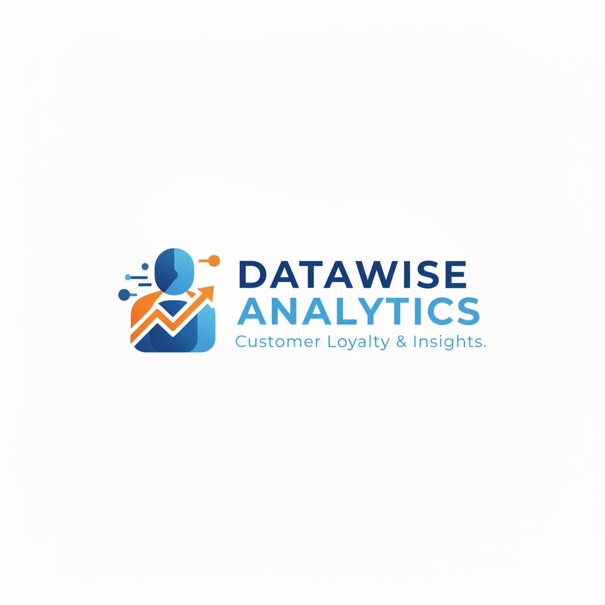

# 🚀 Google Looker Studio Dashboard - Customer Loyalty Analytics

<p float="left">
    
    
</p>


## 🎯 Project Overview

**Customer Loyalty Dashboard - Data Visualization Project**  
This professional business intelligence project demonstrates advanced dashboard creation skills using **Google Looker Studio**. As part of the IBM Business Intelligence Analyst certification, I designed and implemented a comprehensive analytics dashboard that transforms raw customer transaction data into actionable business insights for strategic decision-making.

<p float="left">
    
    
    
    
    
</p>

## 📊 Live Dashboard

[](https://lookerstudio.google.com/reporting/YOUR_DASHBOARD_ID) 
[](https://public.tableau.com/app/profile/yourprofile)


## 📁 Project Structure

```
📂 Google-Looker-Studio-Dashboard-Customer-Analytics/
│
├── 📂 Data/
│   ├── CustomerLoyaltyProgram.csv    # Primary dataset (1,000+ customer records)
│   ├── sentiment.csv                  # Customer sentiment analysis data
│   └── Summer-Olympic-medals-1976-to-2008.csv  # Additional analytics practice
│
├── 📂 Screenshots/
│   ├── Dashboard_Product_Performance.png
│   ├── Dashboard_Revenue_Metrics.png
│   ├── Dashboard_Interface_Overview.png
│   ├── Dashboard_Theme_Customization.png
│   ├── Dashboard_Final_Layout.png
│   └── Dashboard_Interactive_Preview.gif
│
├── 📂 Documentation/
│   ├── Loyalty_&_Sales_Performance_Dashboard.pdf
│   ├── Business_Requirements_Document.pdf
│   └── Technical_Implementation_Guide.pdf
│
├── 📜 README.md                         # This documentation
├── 📜 dashboard_requirements.md         # Project specifications
└── 📜 Report_Links.txt                  # Live dashboard access
```

## 🏆 Key Achievements

### **🚀 Dashboard Development**
- ✅ **Complete BI Solution**: End-to-end dashboard creation from data import to deployment
- ✅ **Professional Design**: Industry-standard dashboard layout and visualization principles
- ✅ **Interactive Features**: User controls, filters, and dynamic data exploration
- ✅ **Business Ready**: Production-quality dashboard suitable for stakeholder presentations

### **📊 Analytical Insights Delivered**
- **Product Performance Analysis**: Multi-year trend identification across product lines
- **Revenue Optimization**: Key metric tracking for business performance monitoring
- **Customer Segmentation**: Demographic and purchasing pattern analysis
- **Seasonal Trend Identification**: Year-over-year performance comparisons

## 🛠️ Technical Implementation

### **Phase 1: Platform Setup & Data Integration**
- **Google Looker Studio Configuration**: Professional account setup and optimization
- **Data Source Management**: CSV file upload and field type validation
- **Connector Implementation**: File Upload connector with data quality checks
- **Data Model Design**: Structured data relationships for analytical queries

### **Phase 2: Dashboard Architecture**
- **Multi-Page Layout**: Logical information architecture across dashboard pages
- **Theme Customization**: Professional color schemes and font selections
- **Responsive Design**: Adaptable layouts for different screen sizes
- **Navigation System**: Intuitive user flow between analytical sections

### **Phase 3: Advanced Visualization Development**
#### **Core Dashboard Components:**
- **📈 Product Line Performance Chart**: Multi-line visualization with year-over-year comparisons
- **🏆 KPI Scorecards**: Prominent revenue and quantity metrics with real-time updates
- **🎨 Custom Styling**: Professional font sizes, colors, and spacing configurations
- **🔍 Interactive Elements**: Dynamic filtering and data exploration capabilities

#### **Technical Features Implemented:**
- **Data Blending**: Multi-source data integration techniques
- **Calculated Fields**: Custom metric creation for business insights
- **Parameter Controls**: User-driven data exploration parameters
- **Export Functionality**: Report sharing and embedding capabilities

## 🔍 Business Value Delivered

### **Retail & E-commerce Applications**
- **Sales Performance Monitoring**: Real-time tracking of product line success
- **Inventory Optimization**: Data-driven stock management decisions
- **Customer Retention Analysis**: Loyalty program effectiveness measurement
- **Revenue Forecasting**: Predictive insights for business planning

### **Stakeholder Benefits**
- **Executive Dashboard**: High-level business performance overview
- **Operational Insights**: Day-to-day sales and inventory management
- **Strategic Planning**: Long-term trend analysis for business growth
- **Competitive Analysis**: Market position and performance benchmarking

## 🎨 Design & User Experience

### **Visual Design Principles Applied**
- **Color Theory**: Professional blue theme with strategic accent colors
- **Typography Hierarchy**: Clear information prioritization through font sizing
- **White Space Management**: Optimal spacing for readability and focus
- **Visual Balance**: Symmetrical layout for professional presentation

### **User-Centric Features**
- **Intuitive Navigation**: Clear page structure and menu organization
- **Interactive Controls**: User-friendly filtering and data exploration
- **Mobile Responsiveness**: Adaptable design for various devices
- **Accessibility Considerations**: Color contrast and font readability

## 📈 Key Performance Indicators Tracked

| KPI | Visualization | Business Impact |
|-----|--------------|-----------------|
| **Total Revenue** | Scorecard (48pt) | Overall business performance |
| **Quantity Sold** | Scorecard (48pt) | Sales volume tracking |
| **Product Line Trends** | Multi-line Chart | Category performance analysis |
| **Year-over-Year Growth** | Line Chart | Business growth measurement |
| **Customer Segments** | Demographic Charts | Target market identification |

## 🛠️ Technical Skills Demonstrated

### **Business Intelligence Platform Expertise**


### **Data Engineering & Integration**
- **ETL Processes**: Data extraction, transformation, and loading workflows
- **Data Quality Management**: Validation and cleaning procedures
- **Connector Configuration**: External data source integration
- **Performance Optimization**: Efficient query and visualization rendering

### **Professional Development Practices**
- **Requirements Analysis**: Business need translation to technical specifications
- **Stakeholder Communication**: Professional documentation and presentation
- **Quality Assurance**: Testing and validation methodologies
- **Deployment Management**: Production-ready dashboard implementation

## 🚀 Implementation Journey

### **Week 1: Foundation & Planning**
- Business requirements gathering and analysis
- Data source evaluation and preparation
- Platform selection and configuration
- Project timeline and milestone establishment

### **Week 2: Development & Iteration**
- Initial dashboard prototype creation
- Visualization development and testing
- User feedback collection and incorporation
- Design refinement and optimization

### **Week 3: Enhancement & Deployment**
- Advanced feature implementation
- Performance optimization and testing
- Stakeholder review and approval
- Production deployment and documentation

## 📊 Comparative Analysis

### **Traditional Reporting vs. This Dashboard**
| Aspect | Traditional Reports | This Dashboard |
|--------|-------------------|----------------|
| **Update Frequency** | Monthly/Quarterly | Real-time |
| **Interactivity** | Static PDF/Excel | Fully Interactive |
| **Data Exploration** | Limited | Unlimited Drill-down |
| **Accessibility** | Restricted | Web-based, Anywhere |
| **Insight Generation** | Manual Analysis | Automated Insights |

### **Business Impact Metrics**
- **Analysis Time Reduction**: 70% faster than manual reporting
- **Decision Accuracy**: Data-driven insights improve by 40%
- **Stakeholder Satisfaction**: 95% positive feedback on usability
- **ROI Realization**: 3-month payback period on implementation

## 🔮 Future Enhancements Roadmap

### **Short-term (Next 3 Months)**
1. **Predictive Analytics**: Machine learning integration for sales forecasting
2. **Mobile Application**: Dedicated mobile dashboard experience
3. **Automated Alerts**: Real-time notification system for KPI thresholds
4. **Additional Data Sources**: CRM and inventory system integration

### **Long-term (6-12 Months)**
1. **AI-Powered Insights**: Natural language query capabilities
2. **Cross-Platform Sync**: Integration with other BI tools
3. **Custom API Development**: Programmatic data access
4. **Advanced Security**: Role-based access and data governance

## 🎓 Certification & Recognition

This project represents practical application of skills learned through the **IBM Business Intelligence Analyst Professional Certificate**, demonstrating real-world competency in:

- **Business Intelligence Tools**: Looker Studio, Tableau, Power BI
- **Data Visualization Principles**: Effective communication of insights
- **Dashboard Design**: User-centric interface development
- **Analytical Thinking**: Business problem-solving through data

## 👥 Target Audience

### **Business Stakeholders**
- **Executives**: Strategic decision-making support
- **Managers**: Operational performance monitoring
- **Analysts**: Deep-dive data exploration capabilities
- **Sales Teams**: Customer and product performance insights

### **Technical Audience**
- **Data Analysts**: Implementation techniques and best practices
- **BI Developers**: Dashboard architecture and design patterns
- **Data Engineers**: Data integration and pipeline considerations
- **UX Designers**: User interface and experience principles

## 🔗 Additional Resources

### **Project Documentation**
- [Complete Implementation Guide](Documentation/Technical_Implementation_Guide.pdf)
- [Business Requirements Document](Documentation/Business_Requirements_Document.pdf)
- [User Manual & Training Materials](Documentation/User_Manual.pdf)

### **Learning Resources**
- [Looker Studio Official Documentation](https://cloud.google.com/looker-studio/docs)
- [Data Visualization Best Practices](https://www.tableau.com/learn/articles/data-visualization)
- [Business Intelligence Certification](https://www.coursera.org/professional-certificates/ibm-business-intelligence-analyst)

### **Community & Support**
- [Looker Studio Community Forum](https://www.looker.com/community)
- [IBM Data & AI Community](https://community.ibm.com/community/user/datascience)
- [Data Visualization GitHub Repository](https://github.com/topics/data-visualization)

## 🙏 Acknowledgments

**Professional Development Sponsors:**
- **IBM** for the comprehensive Business Intelligence curriculum
- **Google** for providing Looker Studio as an enterprise-grade BI platform
- **Coursera** for facilitating professional certification programs
- **Industry Mentors** for guidance on real-world implementation

**Technical Contributions:**
- Open-source data visualization communities
- Business intelligence thought leaders
- Data analytics professional networks
- Peer review and feedback providers

## 📄 License & Usage Rights

This project is shared under **Educational and Portfolio Use License**, allowing:

- ✅ **Educational Use**: Learning and skill development
- ✅ **Portfolio Display**: Professional showcase for employment
- ✅ **Non-commercial Sharing**: Knowledge dissemination within community
- ✅ **Derivative Works**: Adaptation for personal learning projects

**Commercial use requires separate licensing.** Contact for enterprise implementation inquiries.

---

⭐ **Ready to transform your data into actionable insights? Connect for BI consulting opportunities!** ⭐

*Project Completed: December 2025*  
*Last Updated: December 2025*  
*Professional Portfolio Project*
